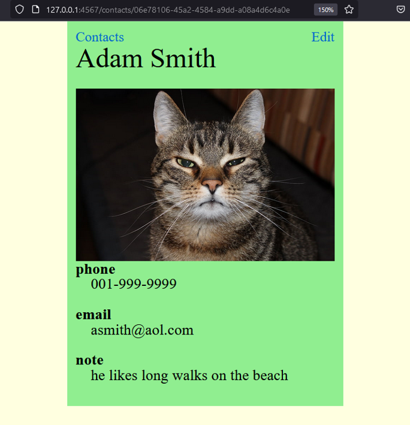
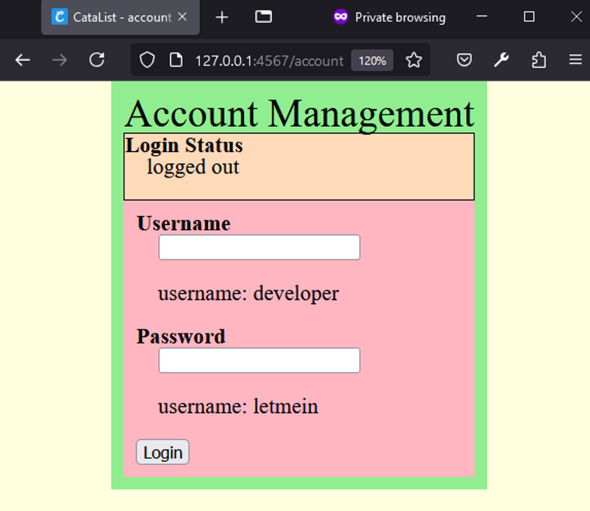
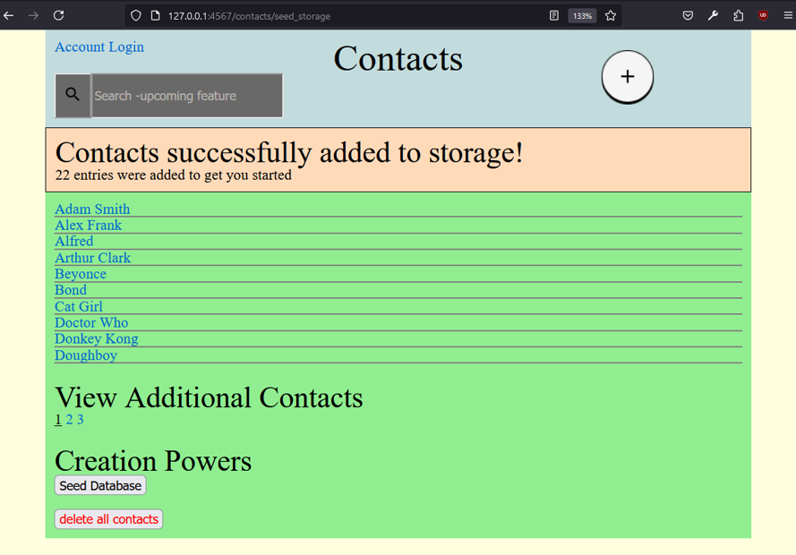
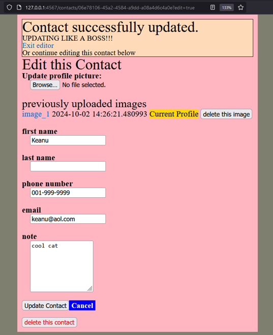
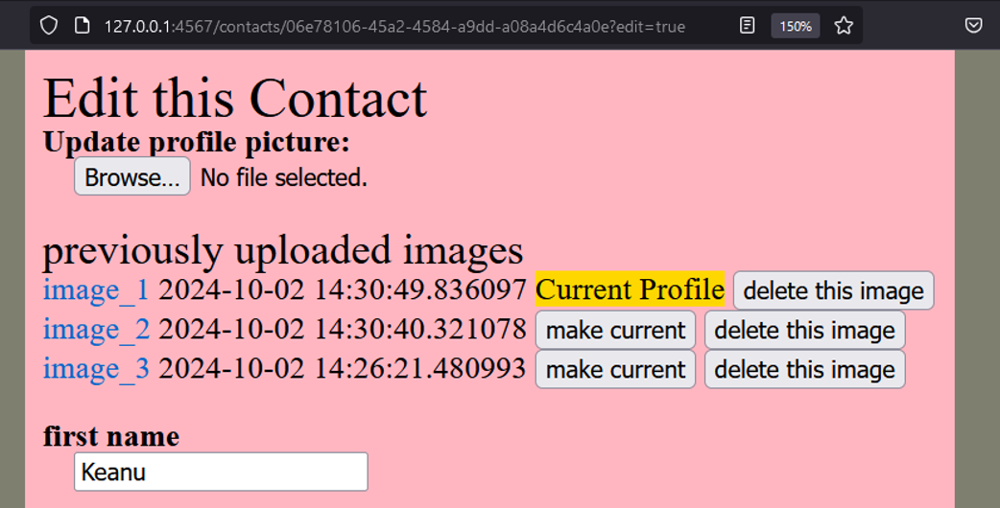

# CataList

A contacts management app for keeping track of your favorite feline (or human) contacts.

## Design Choices
This was modelled after the add contacts feature on an iphone. It could have simply been a contact app for humans, however cats are cuter, so CataList is an app cats can use to keep their feline friends on speed dial (This is why the default image provided when no image is provided is that of a quizzical cat!)

This application is currently only designed to work with one user, credentials are hard coded on the login page.

## Browser Compatibility
This app was tested in Firefox version `130.0.1 (64-bit)`

## Tech Stack Overview
- Ruby is used for the backend code
- Bundler, for dependency management
- PostgreSQL, for an RDBMS
- Rake, for running tasks that could also be run via command line

Configuration details provided in subsequent section.

## Install, Configure, & Run CataList

### Instal PostgreSQL
__PostgreSQL must be installed__ on your system in order for this app to run. PostgreSQL is a powerful, open source object-relational database system. Testing was successfully competed using version `14.13`, (specifically psql (PostgreSQL) 14.13 (Ubuntu 14.13-0ubuntu0.22.04.1)). While other versions may work, it is recommended that at least this version be installed on your system.
- [Visit Official PostgresSQL Download Instructions](https://www.postgresql.org/download/)

#### Special Note For Linux Ubuntu Installs
I found the base instructions provided by the official documentation to be insufficient for the full functioning of this app. Having completed the official instructions, I then needed to run the following command, which installs additional modules found in the contrib directory of the PostgreSQL distribution. (More information for configuring your Ubuntu install can be found via [launch school's ubnutu guide](https://launchschool.medium.com/how-to-install-postgres-for-ubuntu-linux-fa06a162348))

- `sudo apt-get install postgresql postgresql-contrib libpq-dev`

### Install Ruby

__Ruby must be installed__ on your system in order for this app to run. Ruby is a high level programming language. Testing was successfully completed using ruby version `3.3.5`. While other versions may work, it is recommended that at least this version be installed on your system.
- [Visit Ruby's website for Installation Instructions](https://docs.ruby-lang.org/en/)

### Install Bundler

__Bundler must be installed__ on your system in order for this app to run. Bundler is a dependency management system that ensures Ruby applications run the same code on every machine. Testing was successfully completed  with bundler version `2.5.16`, though most other versions will probably suffice. (Any modern distribution of Ruby comes with Bundler preinstalled by default.)
- [Visit Bundler's website for Installation Instructions](https://bundler.io/)

### Install app dependencies via bundler
The `bundle install` command will install all of the required gems for this project. If you have problems running the app, check to see if the gem versions you are using differ greatly from those in the `Gemfile.lock` file. This file contains those version which have been successfully tested. (Newer versions without test coverage) may cause errors. To troubleshoot, update your gemfile to match the project Gemfile.lock's results.

Run the following command in the command line (Project directory)
- `bundle install`

### Create and seed database via rake command
Run the following command in the command line (Project directory)
- `bundle exec rake create_db_with_schema`

### Run app
Run the following command in the command line (Project directory)
- `bundle exec rake app`

If this runs successfully, the command line will indicate the local url where you can interact with the app via the browser.

#### Troubleshooting - What to do if bundler doesn't work
Rake is simply automating the running of a series of shell commands. If for whatever reason you are unable to get rake to run, try running the commands manually in the shell. Commands are located in the file entitled `Rakefile`.

## Getting Started
### Login
Credentials are written in plain text on the login page.

### Optional Step - Seed database
After successful login you will be redirected to the homepage. On this homepage there is a button labelled "Seed Database." Upon clicking this, you will be have a number dummy data added to the contacts database.

### Create, Read, Update, or Delete Contacts
CRUD options are available via various web forms within the app.

### Upload and reuse old profile pics

## Data Cleanup

Step 1. From within the app, click the "delete all contacts" button. This will
- delete all rows from both tables
- delete all added images from the filesystem

Step 2. From the command line, run the following rake command in order to drop the CataList database from postgreSQL
- `bundle exec rake drop_database`